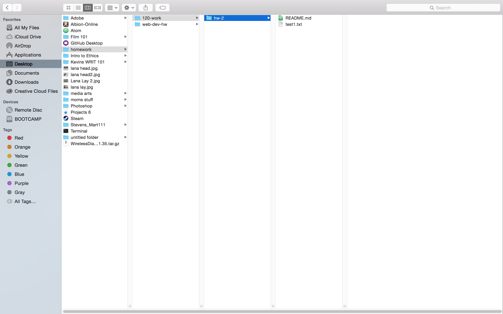

# Kevin M Stevens Jr 51

## My second readme.md made this week

This is the seconed readme.md that I have made this week. Mostly for this cycle I've spent a lot of time trying to memorise the command prompts for markdown and terminal. Since Michael Musick is the one who developed the coarse for intro to web dev, this weeks home work was mainly a repeat of last weeks homework for that class. I didn't have any issuse this week and for now i don't have any questions. I look forward to what is to come next assignment whatever that may be. Below are the examples of the elements requested.

*asterisks*

__bold__

1. list
2. list
3. list

* Item
* Item
  * Item 2a
  * Item 2b

  ---

  `code`

  [I'm an inline-style link with title](https://www.google.com "Google's Homepage")

  
